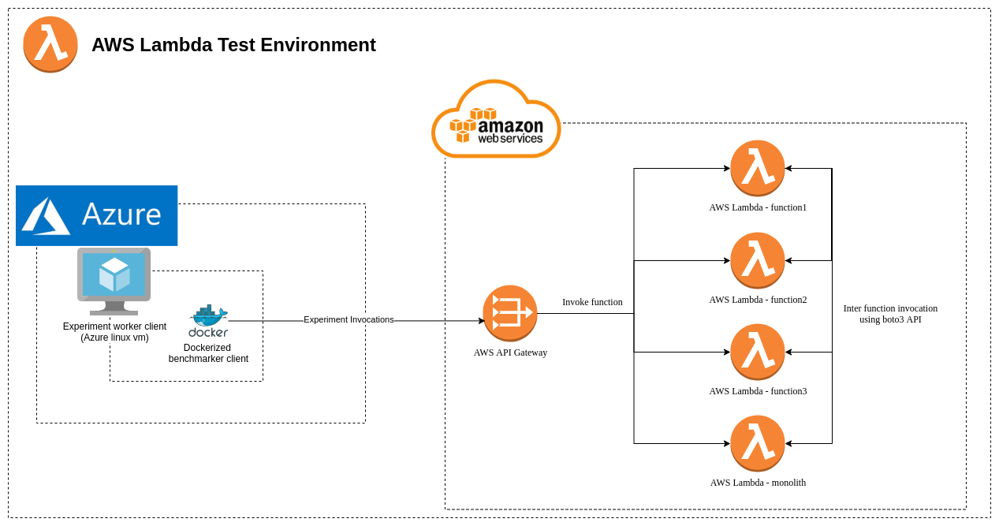
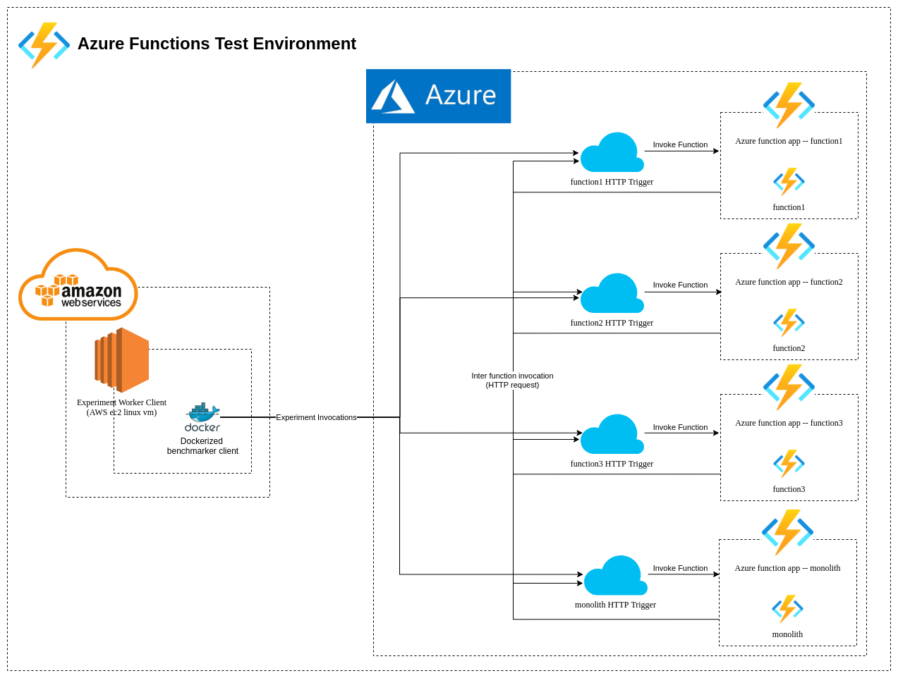
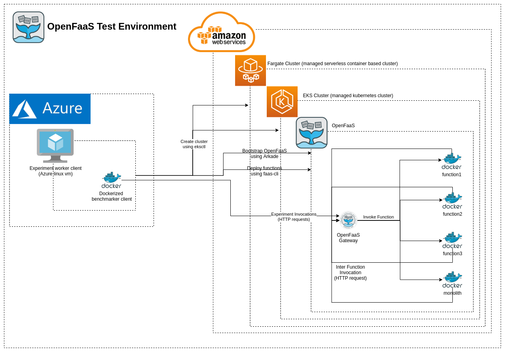

[](https://app.circleci.com/pipelines/github/zanderhavgaard/faas-benchmarker)

```
  __                       _                     _                          _
 / _| __ _  __ _ ___      | |__   ___ _ __   ___| |__  _ __ ___   __ _ _ __| | _____ _ __
| |_ / _` |/ _` / __|_____| '_ \ / _ \ '_ \ / __| '_ \| '_ ` _ \ / _` | '__| |/ / _ \ '__|
|  _| (_| | (_| \__ \_____| |_) |  __/ | | | (__| | | | | | | | | (_| | |  |   <  __/ |
|_|  \__,_|\__,_|___/     |_.__/ \___|_| |_|\___|_| |_|_| |_| |_|\__,_|_|  |_|\_\___|_|
```

A project to benchmark and test the behavior and capabilities of FaaS offerings from public cloud providers and open-source FaaS projects.
The project seeks to increase transparency of closed source FaaS offerings from public cloud providers, by answering questions like: "How long does it take for my function to incur a cold start?", or "When will my function be scaled up due to high demand?".
Further the project strives to make results comparable between cloud platforms, such that users can choose the one that best suits their needs.


---

The project is created by [@ThomasKeralla](https://github.com/ThomasKeralla) (thkh@itu.dk) & [@zanderhavgaard](https://github.com/zanderhavgaard) (pezh@itu.dk) as part of our MSc. Thesis @ the IT-University of Copenhagen.

---


# Experiments

faas-benchmarker is built around providing a convenient way of conducting 'experiments'.
An experiment will be run in the same way against the different FaaS platforms, and in repeatable way such that platform changes can be observed over time.


## Experiment Abstraction

faas-benchmarker centers around the 'experiment' abstraction.
The framework allows users to easily create high level experiments that test or benchmark a specific behavior or metric of FaaS platforms.
The faas-benchmarker framework then handles creating sandboxed environments in which the experiment code is executed against different FaaS platforms.
The experiment code consists of a python script based on a template, in which the the logic for the experiment and metrics are specified.
The script utilizes the `Benchmarker` python class which provides a number of commands like 'invoke_function', which will then be translated into actually invoking the specified function on the different platforms.
The framework handles logging generic data from the experiment invocations.
Though experiment specific data are stored in their own tables and have to be added manually.
Using some automated way of logging experiment specific data points would be preferable, but is currently outside the scope of the project.
New experiments are created from a template using the `fb-cli --create-experiment <experiment name>` command.


### Benchmarker Application

Experiments use the Benchmarker python application.
Experiment scripts instantiate a Benchmarker object that handles translating and interfacing with all of the other components.
Chief amoung these are the 'providers' that implement the AbstractProvider class.
The providers thus provide the platform specific implementations of `invoke_function` and `invoke_function_concurrently`, the Benchmarker then dispatches method calls to the correct provider based on how the Benchmarker is configured.
The benchmarker and experiment code is packaged and distributed as a docker image: [faasbencmarker/client](https://hub.docker.com/u/faasbenchmarker) which is used by the client servers when running experiments.
All docker images are currently being built by a circleci pipeline, and distributed through docker hub. The scripts in the `ci` directory make building the pushing the images easy.


TODO insert graph of benchmarker classes


### Experiment Cloud Functions

faasbenchmarker provides 4 generic cloud functions to conduct experiments on.
These are respectively `function1, function2, function3 & monolith`.
Function 1 through 3 is an attempt at creating a generic 'lab' cloud function.
The function* provide a parameterized interface for configuring invocations using JSON.
The parameters are:
- `StatusCode`: int, the statuscode for the invoker, must be 200.
- `sleep`: float, amount of seconds the function should sleep.
- `thoughput_time`: float, amount of seconds to do arbitrary computations.
- `invoke_nested`: list, JSON list with parameters for invoking functions from within the invoked function.

The `monolith` function is an answer to the convention that cloud functions should be as small and atomic as possible, by instead making a big function that contains a lot of different, although arbitrary, functionality, accessed by passing different parameters to the function.
The monolith accepts the following extra parameters as well as the ones described above.
- `args`: int, The complexity of the function to compute.
- `run_function`: string, which function to use.
- `seed`: int, seed to use for randomness.


Following is a example of invoking function1, which will perform a nested invocation of function2, which in turn will perform a nested invocation of function3.

```python
invoke_nested = [
    {
        "function_name": f"{experiment_name}-function2",
        "invoke_payload": {
            "StatusCode": 200,
            "invoke_nested": [
                    {
                    "function_name": f"{experiment_name}-function3",
                    "invoke_payload": {
                        "StatusCode": 200,
                        }
                    },
                    {
                    "function_name": f"{experiment_name}-function3",
                    "invoke_payload": {
                        "StatusCode": 200,
                        }
                    }
                ]
            }
        }
    ]
benchmarker.invoke_function(function_name='function1',
                            function_args={"invoke_nested":invoke_nested})
```

Example of using `invoke_function_concurrently` to invoke function1 7 times in parallel.

```python
args = {
    'throughput_time': 0.2
}
response = benchmarker.invoke_function_conccurrently(
  function_name='function1',numb_threads=7,function_args=args)
```

## Creating Experiments

Creating a new experiment is done by using the `fb-cli` tool.
Invoking the `--create-experiment` and providing an experiment name will copy all of the relevant templates and modify them for the experiment.
The new experiment will consist of a `<experiment name>.py` which is the expreiment logic and a `<experiment name>.tfvars` which are experiment specific tweaks to the terraform templates.
As well as a number of directories containing the experiment specific infrastructure.
In order ensure that experiments are as reproducible as possible, each experiment has it's own infrastructure.
Thus when an experiment is run, fresh cloud function instances and client servers are created to conduct the experiment.
All of the infrastructure files are automatically generated and should not be edited manually.
If changes are made to the templates, the templates for each experiment will need to be regenerated using the `fb-cli --update-experiment-infrastructure-templates` command.
Thus when writing a new experiment only the `<experiment name>.py` file should be edited, and perhaps the `<experiment name>.tfvars`, if the experiment needs a larger client server for more concurrency etc.


# Architecture
The architecture of faas-benchmarker is divided into three main parts, the `permanent infrastructure`, the `cloud functions` and the `experiment infrastructure`.

Currently the permanent infrastructure is hosted on Digital Ocean. Experiments are conducted on mix of AWS and Azure resources. The use of different cloud providers is make the most of the different free/student offerings, as well as to utilize different cloud-specific tools.


## Permanent Infrastructure
The permanent infrastructure consists of two servers, the `orchestrator` and the `database` servers, as well as a blob storage.
The purpose of the orchestrator is to orchestrate the experiments; managing experiment lifecycles, bootstrapping and destroying experiment infrastucture, running experiment code.
The database server hosts a sql database with experiment results and log files from experiment runs.
The permanent infrastructure is currently hosted on two Digital Ocean droplets (linux vms), though if desired these could easily be moved to another cloud provider, or even self hosted.


## Cloud Functions
Currently faas-benchmarker supports `AWS lambda`, `Azure Functions` and `OpenFaaS`. 'Support' for a cloud function platform consists of an implemtation of the 'lab functions' as described above, as well as a 'provider' python class to interface the framework with the cloud function platform.
The different cloud funtions are created as needed from templates using terraform.
AWS Lambda and Azure Functions run on their respective clouds, OpenFaaS is bootstrapped into a AWS EKS Fargate cluster.
EKS on Fargate is AWS managed kubernetes but running purely in Fargate containers, which means that the cluster is 'serverless'.
Which means that OpenFaaS function containers can be scaled independently of the rest of the cluster, thus providing the most 'serverless' way of running OpenFaaS
We use this specific deployment in order to have the most comparable deployment of OpenFaaS with AWS Lambda and Azure Functions.

### Support for New Cloud Function Platforms
Adding support for new cloud function platforms consists of a lab function implementation, the python provider, terraform templates, as well as an orchestration script that handles all of the different quirks of the platform in question, that can be run in the framework.


## Experiment Infrastructure
In order to remove as many potential disturbing factors from the experiments, each experiment consists of a number of isolated environments.
Each of these environment consists of the cloud functions and extra infrastructure that they may require and a server to act as client to these functions.
Each of the cloud function / server environments run opposite clouds, such that for AWS Lambda the client is an Azure Linux vm, and for Azure Funtions the client is an AWS ec2 instance.
This is to create a realistic scenario where the functions have to communicate with something outside of the datacenter, and to elimnitate any internal optimizations or benefits the different cloud providers might implement.
Each of these environments are created when experiment run starts and destroyed when the experiment has been conducted.

The benchmarker application runs in a docker container to ensure that across experiment runs and cloud providers, that the same environment is used.

### AWS Lambda


The AWS Lambda environment consists of the four cloud functions as AWS Lambda functions.
The Lambdas are attached to an AWS API gateway, that creates http endpoints for invoking the functions.
The Lambdas can invoke other Lambdas using the boto3 python API, thus the API gateway is only for handling external requests.
The client is an Azure Linux vm running ubuntu 20.04.

### Azure Functions


The Azure Functions environment consists of four function apps, each containing one of the 4 cloud functions.
The reason for using 4 distint function apps instead of four functions in one functionapp, is that each functionapp seem to run synchronously, which means that cyclic invocations are not possible.
For example if I want function1 to invoke function2, and they are in the same function app, the request will never terminate, as the invocation of function1 will block until that request is finished, thus the nested invocation of function2 will never be accepted, as the functionapp is locked until function1 finishes.
Therefore in order to allow nested invocations, each function is inside it's own function app.
Interestingly this is a surprisingly viable pattern, as the cost of invoking functions remains the same whether they are spread out in different functionapps or in the same one, but it will give you potential for more efficient utilization, as none of the functions will have to wait for other functions in the same function app to finishe before computing.
The downside is that it adds the complexity of managing all of these function apps, instead of just the one.

The client for the Azure Functions is an AWS ec2 instance running Ubuntu 20.04.

### OpenFaaS


The OpenFaaS environment consists of an Azure linux vm as the client.
After the client has been provisioned, the client server will then provision an AWS EKS Fargate cluster and deploy OpenFaaS using the Arkade installer.
After running the experiment, the client will then destroy the EKS cluster.
The OpenFaaS deployment uses the defaults that come with the Arkade installer, apart from that it enables the faas-idler to allow for scaling functions down to 0, and tweaks the faas-idler intervals, as these seem to be creating race conditions with the default values.


# Orchestration

Orchestration of faas-benchmarker is handled by the `orchestrator` server, and only requires human input to start exerriments using the `fb-cli`.

Experiment orchestration starts with the user starting an experiment by using the fb-cli, either interactively or by using the `-r <experiment name>` flag.
When an experiment is started the fb-cli will validate that the experiment is not already running, and then start a sub process for each platform, for example if running the `function-lifetime` experiment, three processes will be started each running the platform specific orchestration script `orchestration/run_experiment_<platform name>`.
Each of these orchestration scripts will then use the `orchestration/orchestrator.sh` script to provision the experiment specific infrastructure.
The Orchestrator script manages the lifecycle of the different terraform environments related to the experiment, and creates and removes a .lock file to indicate the state of the infrastructure.
When the infrastructure has been provisioned, the orchestration script will use the `orchestration/executor.sh` script to execute the experiment code on the client vm.
The executor will then monitor the client vm, and wait for the client to create a file named `done`.
When the done file is found the orchestration script will use the orchestartor script will then destroy the experiment specific infrastructure and release the locks.

## Terraform
Terraform is used to allow all of the infrastructure used in faas-benchmarker to be kept 'as code'.
The directory `infrastrastructure` contains all of the terraform files for the permanent infrastructure as well as all of the `templates` that are used to generate the experiment specific infrastructure files.
When changes have been made to the infrastrucutre templates the fb-cli command `fb-cli --udpate-experiment-infrastrucutre-templates` to generate the new version of the templates for each experiment present.

## fb-cli
The `fb-cli` is used to control faas-benchmarker and to allow for automation of different tasks.
The main features are orhcestrating experiments.

Invoke the fb-cli from inside the root of the faas-benchmaker repository.
Before starting the fb-cli, make sure that you have set the `fbrd` environment variable to point at the path to the local faas-benchmarker repository, eg `export fbrd=/home/ubuntu/faas-benchmarker >> /home/ubuntu/.bashrc && source /home/ubuntu/.bashrc`.
fb-cli is setup as a symlink to the script file `fb_cli/fb-cli.sh`.
When invoking fb-cli it will check that it can find values for all of the environment variables it needs to orchestrate faas-benchmarker, and will exit and prompt the user to set them, if any are not found.
See the getting started section for details on setting the environment variables.

### fb-cli Options
* `-i  | --interactive` : run in interactive mode
* `-d  | --dev` : run in interactive development mode
* `-l  | --list-experiments` : list available experiments
* `-lr | --list-running-experiments` : list experiments that are currently running
* `-r  | --run-experiment [experiment name]` : run experiment with provided [experiment name]
	you may pass multiple experiments to be run in parallel
* `-ra | --run-all-experiments` : run all experiments
* `--generate-report` : generate report based from result {not implemented yet}
* `--create-experiment [experiment name]` : create new experiment with provided [experiment name]
* `--update-experiment-infrastructure-templates` : update infrastructure templates for existing experiments
* `--bootstrap-permanent-infrastructure` : create the orchestrator and database/log servers
* `--destroy-permanent-infrastructure` : destroy the orchestrator and database/log servers
* `--ssh-orchestrator` : ssh to the orchestrator server
* `--ssh-db-server` : ssh to the database/log server
* `-h | --help` : print commands

### fb-cli Development Options
* `run_experiment_locally` : Interactively choose an experiment to run locally against a local OpenFaaS deployment.
* * `rerun_last_experiment_locally` : Rerun the last select experiment locally.
* `echo_minikube_openfaas_password` : Print the OpenFaaS password.
* `fix_minikube_port_forward` : Attempt to fix port forwarding for faas-cli.
* `start_minikube` : Will start minikube if it was stopped, if no minikube exists, will create one.
* `stop_minikube` : Stop running minikube instance.
* `minikube_openfaas_status` : Show status for Minikube and faas-cli.
* `bootstrap_openfaas_locally` : Create minikube cluster and bootstrap OpenFaaS.
* `teardown_openfaas_locally` : Destroy local minikube cluster.


## webui


# Results Report

## Generating a Report

TODO


# Developement

## Running Experiments Locally


# Getting Started

## Secrets

### Environment variables

#### Terraform Environment

### SSH keys
